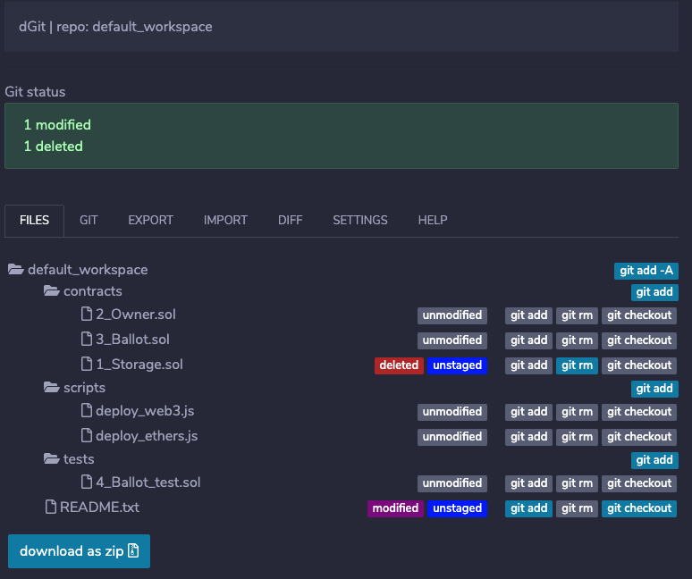
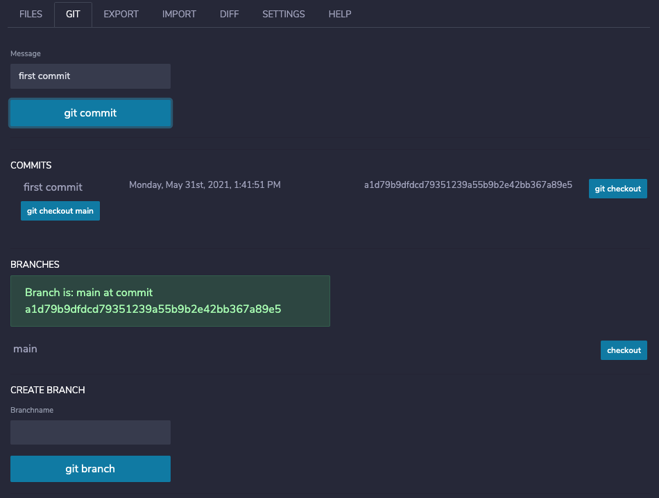
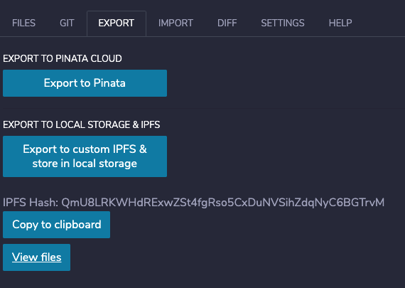
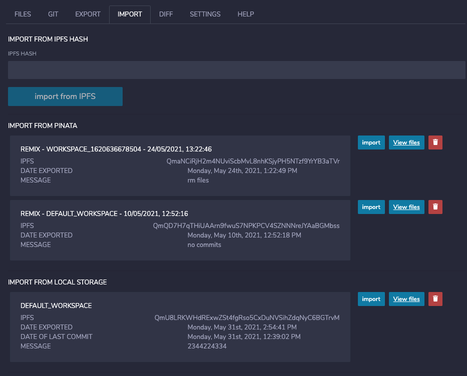

# A decentralized git plugin for Remix
______________________________________

- [A decentralized git plugin for Remix](#a-decentralized-git-plugin-for-remix)
  - [Requirements](#requirements)
  - [What does it do?](#what-does-it-do)
  - [Pinata Cloud](#pinata-cloud)
  - [Git operations](#git-operations)
  - [2 ways Importing/exporting](#2-ways-importingexporting)
  - [Is 'Export' the same as 'push'?](#is-export-the-same-as-push)
  - [Is 'Import' the same as 'pull'?](#is-import-the-same-as-pull)
  - [File collaboration](#file-collaboration)
  - [Which custom IPFS can I use?](#which-custom-ipfs-can-i-use)
  - [Cloning on desktop](#cloning-on-desktop)
  - [Why not use Github?](#why-not-use-github)
  - [How can I get my files from Github?](#how-can-i-get-my-files-from-github)
  - [How can I get my files into Github?](#how-can-i-get-my-files-into-github)
- [Basic Operations](#basic-operations)
  - [Manage files](#manage-files)
  - [Manage git](#manage-git)
  - [Exporting](#exporting)
  - [IPFS](#ipfs)
  - [Importing](#importing)
  - [Code sharing](#code-sharing)
  - [Set up Pinata](#set-up-pinata)
<br>

## Requirements

- Run the IDE on HTTPS
- Do not run in icognito mode when third party cookies are blocked

## What does it do?

This plugin tracks your files in Remix as a git repository and allows you to store it as a git repository in IPFS.<br>
This repo is stored in your browser but you can export and import it from IPFS using the plugin, that way your repo is safe.<br>
Each time you export it will generate a new unique IPFS hash for you.<br>
In IPFS you will find your browser's files there commmited plus the git repository itself ( .git ).<br>
These hashes are stored in your browser's local storage or you can export them to Pinata Cloud.<br>

## Pinata Cloud

To ensure that data persists on IPFS, and is not deleted during garbage collection, data can be pinned to one or more IPFS nodes.<br>
As such, you should use that control to pin any content you wish to keep on IPFS indefinitely.<br>
Pinata gives you free pinning up to 1GB of data, which should be enough to keep your projects.<br>
<a href="https://pinata.cloud" target="_blank">Pinata Cloud</a>

## Git operations

You have to use the app in the same way you would when you'd manage your files in a git repo.<br>
Files are not added by git automatically, you need to add, stage and commmit them like you would do normally.<br>

## 2 ways Importing/exporting

The plugin offers you 2 ways to import/export your files:
- You store the git repo in IPFS and your browser keeps a list of your hashes
- You store the git repo in IPFS and you export the hash to a list in Pinata Cloud

## Is 'Export' the same as 'push'?

No, export creates a unique version in IPFS, because IPFS can't be updated.<br>So it's not called a push
although you keep your entire GIT repo with its history.

## Is 'Import' the same as 'pull'?

No, it will pull the repo from IPFS in its entirety and create a new workspace in Remix. It is basically always a 'clone'.


## File collaboration

You can share files by sharing the IPFS hash that was created when you exported.<br>
But each time you export a unique version is created in IPFS, so if someone else works on the files they will also export a unique version.<br>
This app does not replace GitHub when it comes to collaboration features.

## Which custom IPFS can I use?

You can start your own IPFS daemon and set it to localhost in the config of the plugin.<br>
However you need to configure your IPFS daemon to accept calls from a web app by setting the Access-control-allow or CORS headers.<br>
Checkout the IPFS daemon documentation on how to do this.<br>

```
  "API": {
    "HTTPHeaders": {
      "Access-Control-Allow-Credentials": [
        "true"
      ],
      "Access-Control-Allow-Headers": [
        "Authorization"
      ],
      "Access-Control-Allow-Methods": [
        "GET",
        "POST"
      ],
      "Access-Control-Allow-Origin": [
        "*"
      ],
      "Access-Control-Expose-Headers": [
        "Location"
      ]
    }
  }
```

## Cloning on desktop

It is a git repo. If you wish to clone it on your desktop with 'IPFS get'. Use the IPFS to do this.

## Why not use Github?

This is not a GitHub app but a decentralized way of doing bits of what GitHub does. It's not a replacement.
## How can I get my files from Github?

You can clone the files on your desktop, put them in IPFS and use the IPFS hash to import them into the plugin.<br>
Be careful: the browser does not have unlimited storage, large repositories will not work!

## How can I get my files into Github?

You can get the files from IPFS and just add an origin and push.<br>

# Basic Operations

## Manage files

When you have a workspace open your files will appear here:



As you can see git is tracking your files, changes and deletions.<br>
Here you can perform basic git operations<br>
For example to add all files just click 'git Add -A'<br>

## Manage git



## Exporting 

What does exporting actually mean? You files get uploaded to IPFS and are hashed. The hash is your link on IPFS to your files.<br>
Remember that you will always export the files in your working area plus the .git directory.<br>

There are two options
- pin it in Pinata
- just store it in IPFS, the hash will be kept in your browser storage



## IPFS

As you can see when you click 'view files', your files are in IPFS and immutable. 


When you unpin the files, the garbage collection of IPFS nodes will delete the files after aw while.
So be sure to pin it if you need it permanently.

## Importing

It is important to know importing will create a new workspace for you. All the files in IPFS will be loaded into a new workspace.<br>
It is like cloning. You can always delete the old workspace you were working on if there are too many of them.<br>



## Code sharing

Just pass on the IPFS hash you created, the user can import it in their browser.

## Set up Pinata

Go to <a href="https://pinata.cloud" target="_blank">Pinata Cloud</a> and sign up. After that in the section API KEYS you can add a new key.<br>
Copy past that key in to the plugin settings and click 'check connection'.<br>

